*本文为[廖雪峰老师网站Git教程](https://www.liaoxuefeng.com/wiki/896043488029600)的学习笔记，部分内容结合个人理解添加*

# [Git简介](https://www.liaoxuefeng.com/wiki/896043488029600/896067008724000)
> **世界上最先进的分布式版本控制系统**

---
## [Git的诞生](https://www.liaoxuefeng.com/wiki/896043488029600/896202815778784)
***Linus***用两个礼拜，就用 ***C*** 写出了 ***Git*** 。

---
## [集中式 VS 分布式](https://www.liaoxuefeng.com/wiki/896043488029600/896202780297248)
- 集中式
  例如 ***CVS*** 和 ***SVN*** 。集中式版本控制系统把版本库集中存放在中央服务器。很依赖网络。
- 分布式
  每个人都有自己的版本库。中央服务器只是为了方便交换而存在，没有网络并不会严重影响工作。

---
## [安装Git](https://www.liaoxuefeng.com/wiki/896043488029600/896067074338496)
**略略略**

---
## [创建版本库](https://www.liaoxuefeng.com/wiki/896043488029600/896827951938304)
### 一. 创建
**我**用Git Bash比较顺手，所以下面的介绍都是**Git Bash**的  
流程：
1. 首先选一个喜欢的目录，比如`C:/user/yourname/learngit`之类的。尽量不要在路径中出现中文，避免出现不必要的麻烦。  
2. 打开Git Bash，切换工作路径到选好的位置，有两种方法:  
   1. 在文件资源管理器中打开选好的文件夹，在里面点击右键，菜单里出现一个`Git Bash Here`，选他，工作路径就自动在选好的位置了。
   2. 打开`Git Bash`，使用`cd C:/user/yourname/learngit`指令即可。（如果用Git CMD的话，切换到不同盘符下的路径需要用`cd /D path`，固定搭配，具体操作可以查一下表。

    不放心的话可以用`pwd`(***<font color=red>P</font>rint <font color=red>W</font>orking <font color=red>D</font>irectory***)指令查看当前的目录。
3. 输入`git init`指令，仓库就创建好了。用`ls -ah`指令查看，可以发现目录下多出了一个`.git`文件夹，这个文件夹就是跟踪管理版本库的。不要乱动这个文件夹里的东西，否则可能会破坏版本库。  

*选定的目录不需要是空的，但是不建议初学时使用有重要文件的文件夹，否则后果自负*

### 二. 向版本库添加文件
*版本控制系统只能跟踪文本文件的改动，比如txt文件和代码等。而对于二进制文件，如图片、视频甚至word文件等，系统只能知道有改动，不能确定改动的内容。*  
1. 在上述创建的**Git仓库所在目录**下添加文件
2. 使用指令`git add [file]`，把文件添加到<font color=pinkblue>暂存区</font>(关于暂存区的概念会在后面提到，不理解可以先向后翻看)
3. 使用指令`git commit -m ["descriptive message"]`把文件提交到仓库，此次提交的说明就是`-m`后面的字符串

有两点提示：  
1. 如果向工作区添加了新文件，则在`commit`前必须`add`，不然新文件不会被提交。  
2. 如果没有新文件，可以使用`git commit -am`指令，就相当于先`add`再`commit -m`。（`-a`即把当前所有修改了的文件添加到暂存）  
3. 一次`commit`前可以多次`add`，`add`够了再`commit`也可以。

---
---
# [时光穿梭机](https://www.liaoxuefeng.com/wiki/896043488029600/896954074659008)
接下来介绍如何在版本间进行切换。在这之前我们要了解如何查看修改：  
- 当我们修改了工作区的文件，可以使用`git status`指令查看：  
    
  图片中红字的部分就是已修改但没有`add`的文件。  
  如果想要查看修改的内容，就使用`git diff [file]`指令：  
  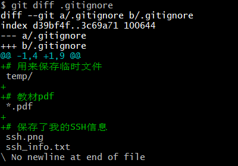  
  结果中前面有减号，红色的部分为删减部分；前面有加号，绿色的为新增的部分。  
  **如果修改过多，可能出现缩略显示的情况，即在Bash窗口最下部显示一个半角冒号`:`，这时按上下键可以翻看全部内容；不想看可以按`ｑ`结束*  
    

- 如果已经`add`过，可以使用`git diff --staged`查看`add`时与最后一次提交之间做出修改。这里不再贴图。  
  将修改`add`到暂存区后，再查看`git status`，结果如图：  
    

- 提交后，`git status`：  
    
  可以看到这时显示工作目录是干净的(working tree clean)，没有要提交的修改。

---
## <span id="reset">[版本回退](https://www.liaoxuefeng.com/wiki/896043488029600/897013573512192)</span>
1. 使用`git log`，查看历史提交记录。  
  例如：  
  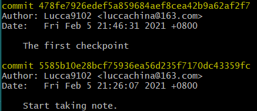  
  其中<b><i>`478fe7...`</i></b>和<b><i>`5585b10...`</i></b>是<kbd>**`commit id`**</kbd>(版本号)  
  如果决定输出太长，不方便查看，可以使用`git log --pretty=oneline`，这样提交信息会被缩减到一行内显示。  
    
  这样，我们就得到了每次提交的版本号和相应的提示信息。  
  *提醒一下，Git的版本号不是递增的数字，而是一个SHA1计算出来的非常大的十六进制数字。这样可以更好地适应多人在同一个版本库里工作的情况。*  
2. 获得版本号后，即可用`git reset --hard HEAD^`回退到上一个提交的版本。`HEAD`表示的是当前的版本，每加一个`^`就表示向前一个版本。如果版本相差太远，比如100个版本，也可以用`HEAD~100`来表示。当然，`HEAD`也可以换成上面提到的版本号(不用全部输入，一般输入前6位就足够了)。  
*这里的`--hard`会使文件退回到选定的版本，未保存的修改将丢失*  
如果不慎选错了版本，也有办法补救。Git的版本回退仅仅是将`HEAD`指针指向这个版本，并更新工作区文件。所以再次`reset`到原来想要的版本号即可。  
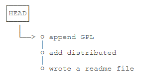  
  
如果不记得版本号，就用`git reflog`指令查看指令记录，包括`reset`和`commit`等。  
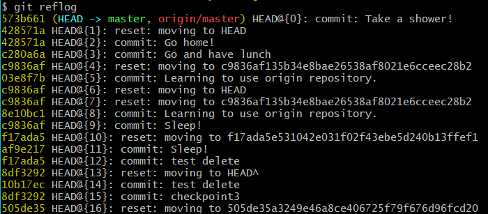  
图中前面的黄字部分就是操作时版本号的一部分，用它们`reset`即可。

---
## [工作区和暂存区](https://www.liaoxuefeng.com/wiki/896043488029600/897271968352576)
- **工作区**  
  在电脑中能够看到的目录，如我使用的的Git文件夹
- **版本库**  
  工作区中有一个隐藏目录<kbd>`.git`</kbd>，这个文件夹就是Git的版本库。版本库中最重要的东西就是称为 ***`stage`*** (或叫 ***`index`*** )的暂存区，还有Git自动创建的第一个分支<kbd>`master`</kbd>，以及指向<kbd>`master`</kbd>的指针<kbd>`HEAD`</kbd>  
  使用`git add`时，会将文件修改添加到<font color=red>暂存区</font>；  
  使用`git commit`时，则会把暂存区的内容提交到<font color=red>当前分支</font>。  
    

---
## [管理修改](https://www.liaoxuefeng.com/wiki/896043488029600/897884457270432)
Git管理的是**修改**，而不是文件。即使增删几个字符也算修改。  
提交文件前必须先添加到暂存区，再提交到版本库。如果没有`add`或`commit -a`，则修改不会被提交。这时用`git status`查看，还会显示有改动但没提交的文件。如果不理解可以动动手，动动脑，做一做这个实验。

---
## [撤销修改](https://www.liaoxuefeng.com/wiki/896043488029600/897889638509536)
如果做出了不符合预期或错误的修改，想要撤销，需要分为以下几种情况讨论：
1. 只做出了修改，没有添加到版本库  
  <s>如果没太大改动就撤销吧，<kbd>Ctrl</kbd>+<kbd>Z</kbd>挺好使的</s>  
  如果改得稀烂，比如我侄子来敲我的键盘，或者猴子们来我的电脑上仿写莎士比亚，那就需要Git来帮忙了。  
  我向Git许愿，Git说，彳亍！然后留下了一串神秘代码:  
  ***`git checkout -- [file]`***  
  `checkout`指令会丢弃工作区的修改，把文件恢复到最后一次添加到版本库时的状态，即最后一次`add`或`commit`时的样子。  
  *<font color=red>注意</font>: 里面的<kbd>`--`</kbd>不能丢，否则会变成另一个指令*  
  不过我在尝试时发现(我使用VS Code编辑)，未保存的修改不会被清除，但是在保存时会提示我当前文件内容较新，无法保存。需要用我的版本和文件内容进行比较，或覆盖文件内容。如图：  
    
  因为不想找麻烦，所以我一般会保存后再恢复。  

2. 已经将修改`add`到了暂存库，但没有`commit`  
   1. 使用`git reset HEAD [file]`指令，把暂存区的修改**撤销(*unstage*)**，重新放回工作区。
   2. `git restore --staged <file>`，作用和`reset`一样，不过文件名是必要的。全部恢复时就使用`git restore --staged .` 即可，<kbd>`.`</kbd>就表示全部文件。(不过restore这个指令我不太熟悉，使用前建议查表)
3. 已经`commit`，但是没有推送到远程仓库  
  还有救，按照[版本回退](#reset)一节的方法可以`reset`回来。
4. 已经推送到远程仓库  
  **救不了了，等着被制裁吧**

---
## [删除文件](https://www.liaoxuefeng.com/wiki/896043488029600/900002180232448)
1. 直接在资源管理器删除  
  直接删除或使用Linux指令`rm [file]`(别问Windows指令，我也不会)。这样删除会导致版本库和工作区的不一致，这时有两个选择：  
   1. 误删  
    从版本库恢复文件(如果没提交过就拉倒了)，使用`git checkout -- [file]`即可。  
    当然，误删的文件可以恢复，但是会**丢失最近一次添加到版本库后的更改**。因此删文件要谨慎！ 
   2. 我要删我要删！  
    那就需要在版本库里也删除文件。详见下一条。
2. 在版本库中删除文件  
   <s>使用`rm -rf`指令</s> **(千万不要尝试！)**  
   使用`git rm [file]`指令，会同时删除工作区的文件和版本库的文件。  
   *使用`git rm`指令删除的文件<u>**不会进入回收站**</u>，操作前务必考虑清楚*

---
---
# [远程仓库](https://www.liaoxuefeng.com/wiki/896043488029600/896954117292416)
Git是分布式版本控制系统，同一个Git仓库可以分布到不同的机器上。分布的方法就是各台机器克隆原始版本库到本地。每台机器上的版本库都是一样的，没有主次之分。  
在实际操作中，通常是一台机器作为服务器，全天上班，其他人从这里<b>克隆(clone)</b>版本库、将自己的提交<b>推送(push)</b>到服务器以及从服务器仓库中<b>拉取(pull)</b>别人的提交。  
我们可以自己搭建一台服务器，但是现在我还不会XD。所以这一段将介绍利用**GitHub**创建远程仓库。  
在开始之前，需要准备以下几点：  
1. 注册GitHub账号
2. 创建SSH Key  
   在`C:/Users/yourname`文件夹下如果有`.ssh`目录，里面有`id_rsa`和`id_rsa.pub`文件的话，就不需要创建了。  
   如果没有，就在Git Bash中输入以下指令：  
   `$ ssh-keygen -t rsa -C "youremail@example.com"`  
   *参考[ssh-keygen -t rsa -C "content" 解释](https://www.cnblogs.com/xunzhiyou/p/12117261.html)*  
   > -t: The type of the key to generate  
   > -C: comment to identify the key  
   > 也就是说`-C`后面不一定要接邮箱，随便写点什么都行。  

   都是普通老百姓，也没有那么高的保密需要，所以接下来一路回车就行。不放心就查一下怎么加密码。回车到底后，SSH Key就建立完了，可以在用户主目录下的`.ssh`文件夹里找到`id_rsa`和`id_rsa.pub`两个文件。  
   需要注意的是，生成的两个文件分别名为`id_rsa`和`id_rsa.pub`。其中<font color=red>`id_rsa`为私钥，不要泄露给别人</font>；`id_rsa.pub`为公钥，就随便了。  
3. 登录GitHub，打开"Account Settings"中的"SSH Keys"界面，然后点击"Add SSH Key"，Title自拟<s>，正文不少于800字</s>，在Key栏粘贴`id_rsa.pub`文件的内容(用记事本打开即可)。  
   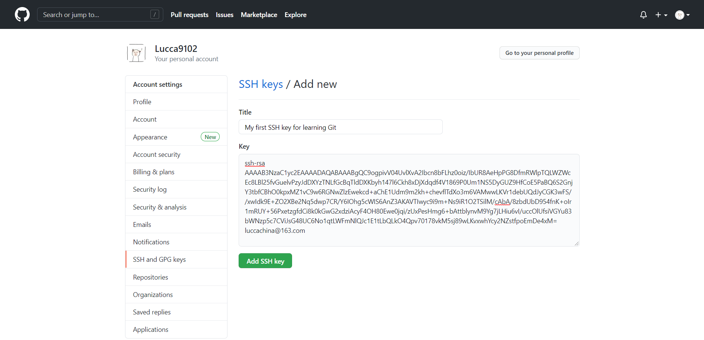
   添加后即可在页面看到
     
   Git支持SSH协议，所以GitHub有了公钥后，就可以确认推送人的身份，确保只有我自己可以提交。  

- **注意**：在GitHub上免费托管的仓库是公开的，但只有自己能够修改。如果想自己雪藏仓库，可以成为GitHub的付费用户，享受私人仓库；或者自己建立一个Git服务器。  

---
## [添加远程库](https://www.liaoxuefeng.com/wiki/896043488029600/898732864121440)
1. 建立远程库  
   在GitHub上创建一个新的repo(自己找吧！)，然后给仓库起个名字，比如我的是`Learning-Git`。其他保持默认，创建仓库即可。
   现在这个仓库是空的，我们可以从这个仓库克隆出新仓库，也可以把一个已有的本地仓库与之关联，然后把本地仓库的内容推送到GitHub仓库。  
2. 关联远程库  
   在Git Bash中输入指令`git remote add origin git@github.com:Lucca9102/Learning-Git`，把仓库关联到GitHub远程仓库。添加后，远程库就叫`origin`。  
3. 把本地内容推送到远程  
   使用`git push`指令，实际上就是把当前的分支`master`推送到远程。  
   第一次推送时，远程库是空的。使用使用`-u`参数，即`git push -u origin master`。这样Git不但会把本地的`master`分支内容推送到远程新的`master`分支，还会把本地的`master`分支和远程`master`分支关联起来。在以后的推送或者拉取时就可以简化指令，使用`git push origin master`即可。  
     
   第一次使用Git的`clone`或`push`指令连接GitHub时，会得到警告。警告大意就是要确认GitHub的Key的指纹信息是否真的来自GitHub的服务器。如果不放心可以和[GitHub的RSA Key的指纹信息](https://docs.github.com/en/github/authenticating-to-github/githubs-ssh-key-fingerprints)对照一下，然后输入`yes`回车即可。之后GitHub的Key就会被添加到信任列表，不会再有警告了。  
     
     

---
## [从远程库克隆](https://www.liaoxuefeng.com/wiki/896043488029600/898732792973664)
在想要克隆远程库的目录下打开Git Bash，有多种方法可以克隆仓库。下面根据其他同学(?)的笔记介绍两种方法：  
1. git(SSH协议) -> 默认，最快  
   `git clone git@github.com:lucca9102/Learning-Git.git`
2. https -> 慢，每次都要输口令；不支持https就不能用  
   `git clone https://github.com/lucca9102/Learning-Git.git`

克隆成功后效果如图：  
  
  

---
---
# [分支管理](https://www.liaoxuefeng.com/wiki/896043488029600/896954848507552)
以我之前小学期做的五子棋游戏为例。程序主要实现的功能有计时、游戏和聊天三项。假设这三项分别分给了两个人做，A已经做好了游戏的部分，而计时做了一半；B的聊天部分出了小bug，会影响游戏进行。这时如果一次性把功能合并在一起，程序的任一部分都没法正常运行。  
这时，为了三个功能互不影响地继续开发，B创建了一个属于自己的分支。A看不到这个分支，还在原来的分支上正常工作。B在自己的分支上工作，开发完毕后，再一次性合并到原来的分支上。这样既安全，又不影响A工作。  
在这种情形下，又体现出了Git相较SVN等的优势：创建、切换和删除分支非常快，远远超过了SVN等。  

---
## [创建与合并分支](https://www.liaoxuefeng.com/wiki/896043488029600/900003767775424)
每次我们提交，Git都会把他们串成一条时间线，这条时间线就是一个分支。按照上面的步骤操作下来，我们目前只有一条时间线，也就是我们的主分支`master`。  
开始时，`master`分支是一条线，<u>Git用`master`指向最新的提交，再用`HEAD`指向`master`</u>。每次提交，`master`分支都会向前移动一步。  
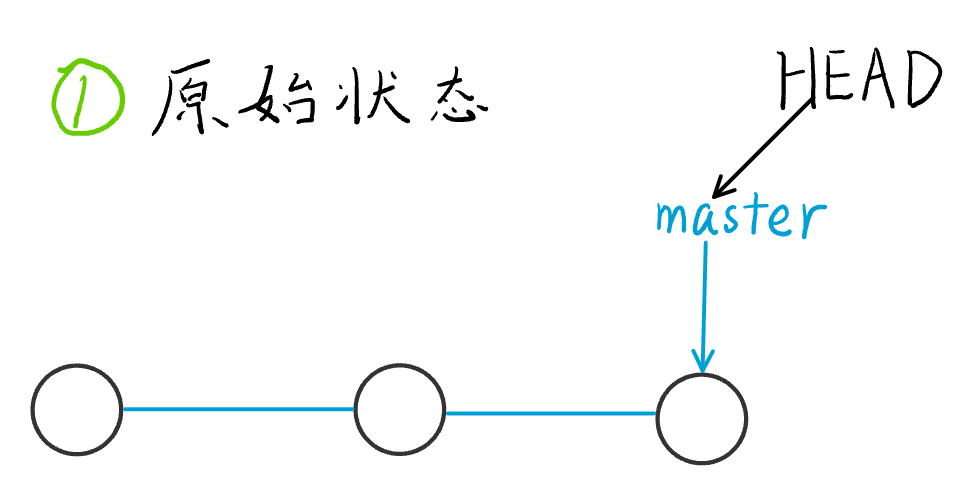  
当我们创建新的分支，例如`dev`，Git就会新建一个指针`dev`，指向和`master`相同的提交，再把`HEAD`指向`dev`。这样就表示了当前分支在`dev`上。这个过程中，Git只需增加一个指针，并改变`HEAD`的指向，无需修改工作区的文件。  
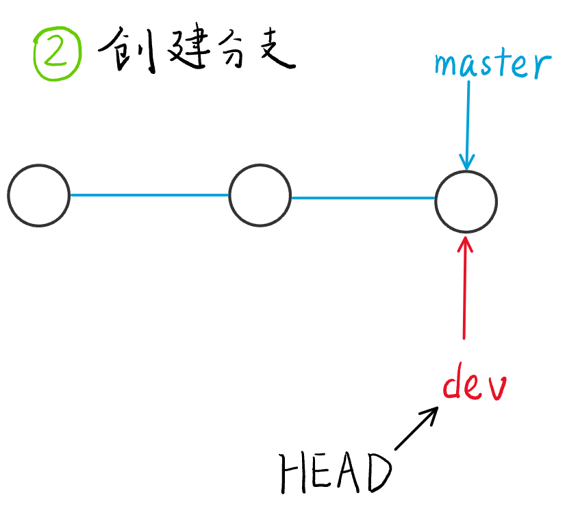  
从现在开始，每次提交后，`dev`指针会向前移动，而`master`指针不会改变。  
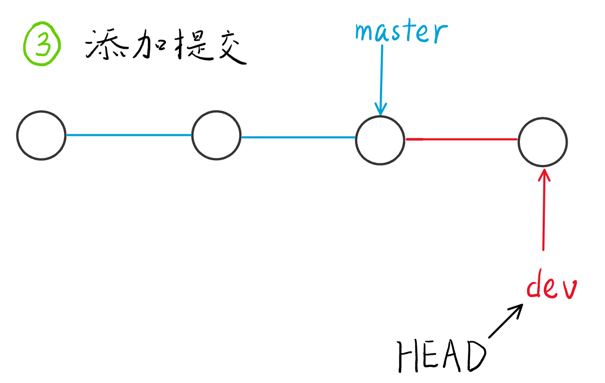  
当完成了`dev`分支上的工作后，我们就可以把`dev`合并到`master`上。最简单的合并方法就是像当初创建分支时一样，直接把`master`指向`dev`的当前提交，就完成了合并。  
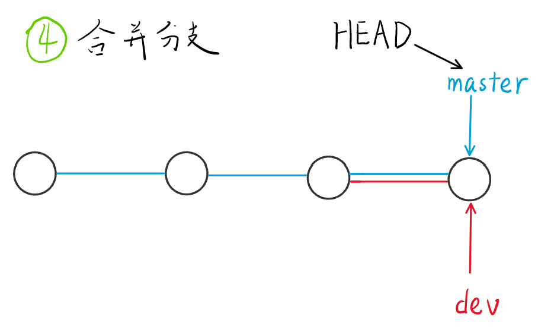  
完成合并后，我们就可以<s>过河拆桥，卸磨杀驴，兔死狗烹，鸟尽弓藏，</s>删除掉`dev`分支，也就是删掉`dev`指针，只留下`master`一条分支。  
  
总结一下，大致步骤就是：
1. 创建分支
   使用`git checkout -b dev`指令，`-b`参数表示创建并切换分支。这条指令也就相当于以下两条指令：  
   ```
   $ git branch dev
   $ git checkout dev
   ```  
   创建后，可以用`git branch`查看所有分支。当前分支，也就是`dev`分支会以绿色显示，并在前面加上<kbd>`*`</kbd>。  
     
   这里的`git checkout [branch-name]`命令与前面的`git checkout -- [file]`很相近，容易混淆。所以新版本的Git提供了 ***`switch`*** 命令。使用方法如下：
   - 创建并切换到新的`dev`分支：`git switch -c dev`  
   - 切换到已有的`master`分支：`git switch master`  

2. 修改并提交到`dev`，方法与在`master`上提交相同。  
     

3. 合并分支  
   `dev`上的工作完成后，就可以合并分支了。  
   1. 切换到`master`分支：`git checkout master`。
   2. 把`dev`分支的工作成果合并到`master`分支：`git merge dev`。这里的`git merge`指令用于合并指定分支到当前分支。  
      合并后，Git会显示`Fast-forward`，也就是说本次合并是“快进模式”，是直接把`master`指向`dev`。不过并不是每次合并都能快进⏩，后面会学习其他合并方式。  
    
    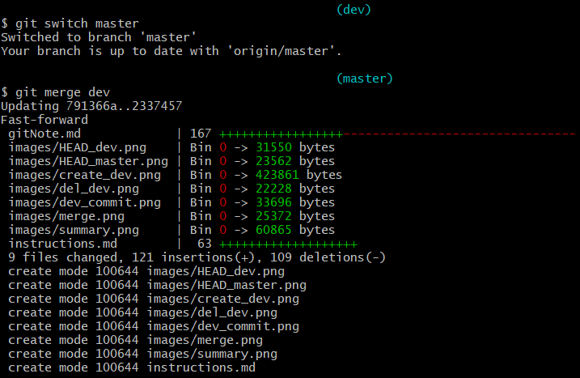  

4. 删除分支  
   使用`git branch -d dev`删除`dev`分支，和它说再见。  
     

---
## [解决冲突](https://www.liaoxuefeng.com/wiki/896043488029600/900004111093344)
1. 首先准备一个新的分支`feature1`。   
   ```
   $ git switch -c feature1  
   Switched to a new branch 'feature1'
   ```
2. 在`feature1`做出修改并提交
   ```
   $ git commit -am "test commit on feature1"
   [feature1 a990895] test commit on feature1
   1 file changed, 12 insertions(+), 2 deletions(-)
   ```
3. 切换回主分支`master`  
   ```
   $ git switch master
   Switched to branch 'master'
   Your branch is up to date with 'origin/master'.
   ```  
   （如果有提交没有被推送到远程仓库，就会出现下面的提醒，不会影响实验效果）  
   ```
   $ git switch master
   Switched to branch 'master'
   Your branch is ahead of 'origin/master' by 1 commit.
     (use "git push" to publish your local commits)
   ```  
4. 在`master`做出修改并提交  
   现在分支状态如下图：
   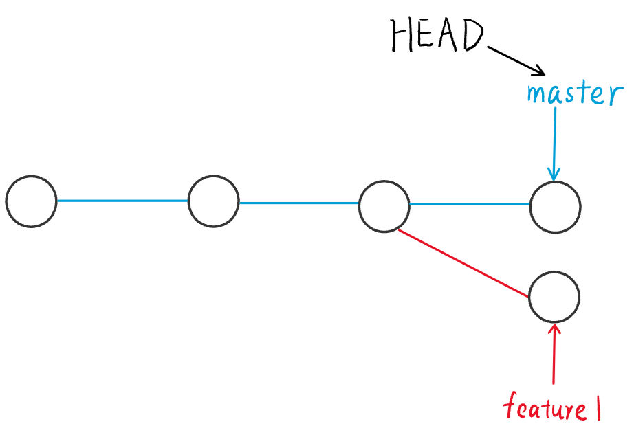
5. 使用`git merge feature1`合并两个分支。这时可以看到：  
     
   就是说两个分支的内容有冲突，需要手动解决后才能提交。  
   此时查看`git status`：  
   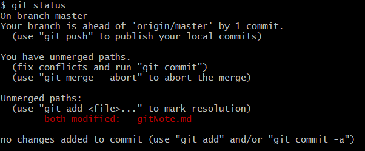  
   *此时`master`除以`unmerged`状态，是无法使用`checkout`等命令的*  
  
   此时查看冲突的文件，可以发现Git用`<<<<<<< HEAD`标记了当前分支的更改；用`>>>>>>> [branch-name]`标记冲突分支的更改；用`=======`分隔冲突的内容。大致如下：  
   ```
   (不冲突的内容...)

   <<<<<<< HEAD
   (当前分支的修改...)
   =======
   (传入分支的修改...)
   >>>>>>> [branch-name]
   ```
   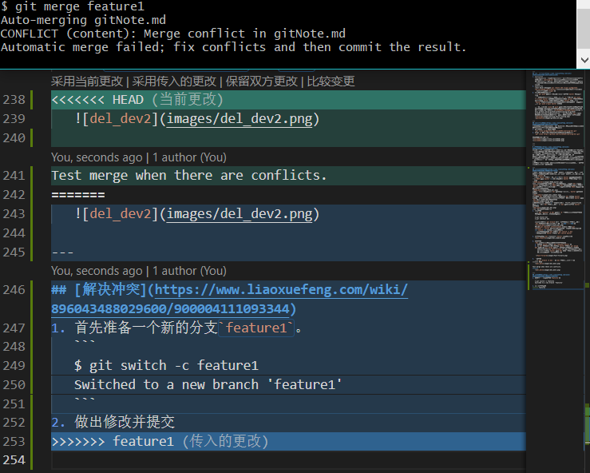  

6. 手动处理冲突，并再次提交，这样就完成了一次有冲突的合并  
   
7. \* 删除`feature1`分支。

做完以上实验后，可以使用`git log --graph`命令查看分支的合并情况：  
  
*其中`--abbrev-commit`是将版本号缩写的意思。更多参数含义可以参考[git 使用详解（5）-- get log 查看提交历史](https://blog.csdn.net/wh_19910525/article/details/7468549)*  
  
在合并分支后，`master`和`feature1`的`commit`记录会按时间顺序被记录在`master`的`log`里：
  

---
## [分支管理策略](https://www.liaoxuefeng.com/wiki/896043488029600/900005860592480)
合并分支时，如果可能，Git会使用`Fast forward`模式。但是这种模式下，删除分支后，会丢掉分支信息。  
如果要禁用`Fast forward`模式，Git就会在合并时生成一个新的提交，这样就可以从分支历史上看出分支信息。  
下面来实验：
1. 创建分支`dev`
2. 修改并添加提交
3. **合并**  
   指令：`git merge --no-ff -m "content" [branch-name]`  
   这里的`--no-ff`就是不要`Fast-Forward`的意思。  
   因为会创建一个新的commit，所以这里还使用参数`-m`，写入commit描述。  
     
4. 删除`dev`分支

这时查看`git log`，发现删除分支后仍然可以看到分支的提交记录，只是分支名不再出现。  
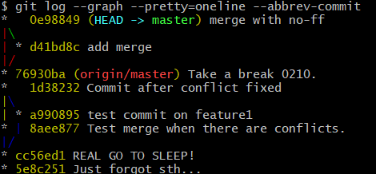  

**分支策略**  
在实际开发中，我们应该按照几个基本原则进行分支管理：  
1. `master`分支应该是非常稳定的，仅用来发布新版本，平时不要在上面干活；  
2. 要干活就开一个`dev`分支，`dev`分支是不稳定的。等到稳定的时候，比如到了版本1.0的时候，把`dev`分支合并到`master`分支上，在`master`分支上发布1.0版本；  
3. 每个人都整个自己的分支，时不时往`dev`上合并一部分就行。  

所以团队合作看起来就是这样：  
  

---
## [Bug分支](https://www.liaoxuefeng.com/wiki/896043488029600/900388704535136)
> <s>在bug开发中，软件出现就像家常便饭。</s>遇到bug时，我们可以快乐建分支，修复bug，然后再合并分支，删除临时分支。  

**但是**，天不遂人愿。当我们得到修复bug的任务时，我们在当前分支的任务很可能还没有完成，而我又不想提交。  
**幸好**，Git提供了`stash`功能，可以把当前的工作现场“储藏”起来，等以后恢复现场后继续工作。  
举个例子，现在我要完善我的命令总结文件，但是在当前`dev`分支上的笔记文件的编辑还没有完成。  
所以我：魔法カード発動！Stashしろ！　　
```
$ git stash
Saved working directory and index state WIP on dev: d03e5fa Updated instructions.md
```  
这样工作区已保存但没添加到版本库的部分就消失了。查看`git status`，可以看到`working tree clean`了。  
现在我切换到`instructions`分支完善我的命令总结。  
完成后返回`dev`分支，首先用`git stash list`看一下我们的stash列表：
```
$ git stash list
stash@{0}: WIP on dev: d03e5fa Updated instructions.md
```
列表中有一个存储内容。  
现在把这部分内容恢复到工作区，有两种方法：
1. `git stash apply`，恢复内容，但不删除stash list中的内容；如果不需要了，就使用`git stash drop`清除  
   ```
   $ git stash apply
   On branch dev
   Changes not staged for commit:
     (use "git add <file>..." to update what will be committed)
     (use "git restore <file>..." to discard changes in working directory)
           modified:   gitNote.md
           modified:   images/branch/merge_noff_log.png
   
   no changes added to commit (use "git add" and/or "git commit -a")
   
   $ git stash drop
   Dropped refs/stash@{0} (65566755d869f90f9862894ab1b44e3e3a7c49c2)
   ```
   这时再`git stash list`就看不到任何内容了

2. `git stash pop`，一步到位，直接取出内容并删除stash  
   ```
   $ git stash pop
   On branch dev
   Changes not staged for commit:
     (use "git add <file>..." to update what will be committed)
     (use "git restore <file>..." to discard changes in working directory)
           modified:   gitNote.md
           modified:   images/branch/merge_noff_log.png
   
   no changes added to commit (use "git add" and/or "git commit -a")
   Dropped refs/stash@{0} (8c5d4cd4d44cc5262ab1e5684945061dfb83f13d)
   ```

完成以上步骤后，我想把`dev`上更新的笔记同步到`instructions`上(或把`instructions`上的命令总结同步到`dev`上)。针对这种情况，Git提供了`git cherry-pick [commit]`命令，这个命令能够把*一个特定的提交*复制到当前分支。  
```
$ git cherry-pick 49e90de
[instructions 8552e23] Test cherry-pick.
 Date: Thu Feb 11 12:18:40 2021 +0800
 2 files changed, 53 insertions(+), 1 deletion(-)
 rewrite images/branch/merge_noff_log.png (99%)
```
需要注意的是，这里要复制的版本号是第一行的`49e90de...`，而复制到分支`instructions`上的则是`8552e23...`。也就是说这两个commit的改动相同，但是它们是两个不同的commit。

再举一个栗子帮助理解：  
我在命令总结里发现了错别字，想要改正它，需要以下步骤：
1. 保存当前工作区的工作  
   ```
   git stash
   Saved working directory and index state WIP on dev: 49e90de Test cherry-pick.
   ```
2. 切换分支  
   ```
   $ git switch instructions
   Switched to branch 'instructions'
   ```
3. 建立Bug分支`fix-typo`并切换  
   ```
   $ git switch -c "fix-typo"
   Switched to a new branch 'fix-typo'
   ```
4. 修改错别字，提交  
   ```
   $ git commit -am "Update instructions.md"
   [fix-typo 39a3945] Update instructions.md
    1 file changed, 16 insertions(+), 4 deletions(-)
   ```
5. 切换回`instructions`分支，合并`fix-typo`，删除`fix-typo`  
   ```
   $ git switch instructions
   Switched to branch 'instructions'

   $ git merge fix-typo
   Updating 8552e23..39a3945
   Fast-forward
    instructions.md | 20 ++++++++++++++++----
    1 file changed, 16 insertions(+), 4 deletions(-)
   
   $ git branch -d fix-typo
   Deleted branch fix-typo (was 39a3945).
   ```
6. 获得版本号，切换回`dev`，将*改正错别字的这次提交*复制到`dev`上  
   ```
   $ git log --pretty=oneline --abbrev-commit
   39a3945 (HEAD -> instructions) Update instructions.md

   $ git switch dev
   Switched to branch 'dev'

   $ git cherry-pick 39a3945
   [dev 0e01e11] Update instructions.md
    Date: Thu Feb 11 14:17:39 2021 +0800
    1 file changed, 16 insertions(+), 4 deletions(-)
   ```

7. 恢复工作区，继续工作  
   ```
   $ git stash pop
   On branch dev
   Changes not staged for commit:
     (use "git add <file>..." to update what will be committed)
     (use "git restore <file>..." to discard changes in working directory)
           modified:   gitNote.md
   ```

总结一下使用`stash`过程中的发现：  
1. stash存储的方式类似栈，每次`stash`后，最后存入的内容标号为`stash@{0}`。取出或删除时默认的stash也是`stash@{0}`  
2. stash的存取时的分支不需要一致，可以在一个分支`stash`，在好几个分支`apply`
3. 假设在分支`test`进行了`stash`操作，切换回其他分支并删除`test`后，存入的`stash`仍然存在，并且在`stash list`中查看时仍然会显示`test`的分支名

---
## [Feature分支](https://www.liaoxuefeng.com/wiki/896043488029600/900394246995648)（强制删除分支）
软件开发中，总要添加新的功能。  
但是我们不想让尚处于实验阶段的新功能代码搞乱了主分支。所以在添加新功能时，最好新建一个feature分支，在上面开发，合并，最后删除该feature分支。  
**但是**，假设这时接到指示，要取消开发并删除这些内容。如果已经提交过，使用`git branch -d [branch-name]`时会失败并报错：
```
$ git branch -d form
error: The branch 'form' is not fully merged.
If you are sure you want to delete it, run 'git branch -D form'.
```
所以要使用`git branch -D [branch-name]`强制删除：
```
$ git branch -D form
Deleted branch form (was 01e282d).
```

总结一下尝试删除分支时的发现：  
1. 如果没提交就切换分支，则修改会被保留（包括工作区和暂存区的修改），即使删除做出修改的分支后也不会消失  
2. 如果提交了修改，之后切换分支，文件会回到目标分支的状态。删除做出修改的分支后，修改会丢失  
3. 如果在新分支新建了文件，并做出了提交，则切换分支时文件会在工作区消失；删除分支时文件似乎确凿也就消失了  
4. 在`test`分支上时不能删除`test`分支，就像不能靠左脚踩右脚的方式起飞  

---
