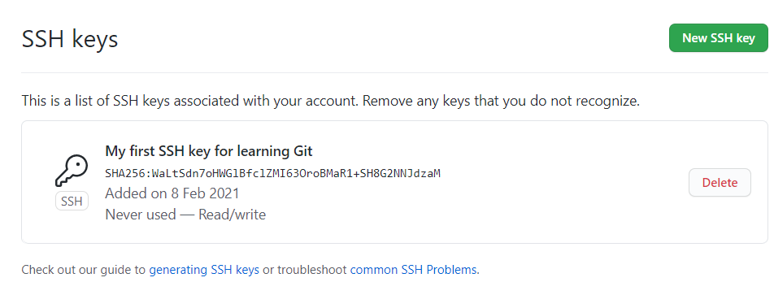
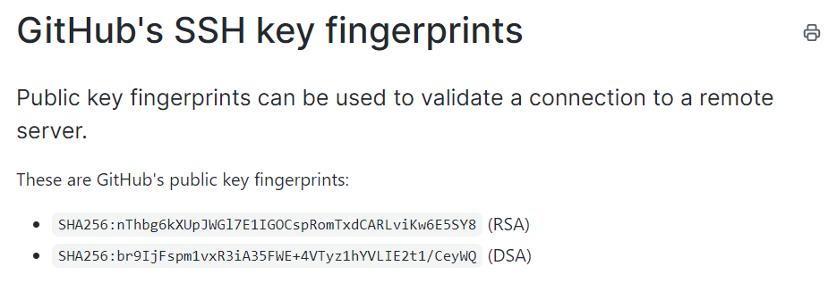
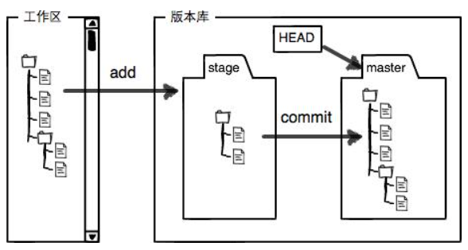

*本文为[廖雪峰老师网站Git教程](https://www.liaoxuefeng.com/wiki/896043488029600)的学习笔记*
# 命令:
- <kbd>`mkdir dir`</kbd>: 创建空目录  
- <kbd>`cd dir`</kbd>: 转到目录  
- <kbd>`pwd`</kbd>: 显示当前目录(***<font color=red>P</font>rint <font color=red>W</font>orking <font color=red>D</font>irectory***)  
- <kbd>`cat filename`</kbd>: 查看文件*filename*的内容
- <kbd>`git init`</kbd>: 把这个目录编程Git可以管理的仓库
- <kbd>`git add`</kbd>: 把文件添加到仓库
- <kbd>`git commit`</kbd>
  - <kbd>`-m "xxx"`</kbd>: 把文件提交到仓库
- <kbd>`git status`</kbd>: 查看仓库的当前状态
- <kbd>`git diff`</kbd>: 查看修改前后的不同  
  - <kbd>`version -- filename`</kbd>: 查看<i>`version`</i>版本与当前状态的差别。(`version`可以是版本号也可以是`HEAD`表示的编号)
- <kbd>`git log`</kbd>: 查看历史提交记录
  - 例如：
    > ```
    > commit 478fe7926edef5a859684aef8cea42b9a62af2f7 (HEAD -> master)
    > Author: Lucca9102 <luccachina@163.com>
    > Date:   Fri Feb 5 21:46:31 2021 +0800
    > 
    >     The first checkpoint
    > 
    > commit 5585b10e28bcf75936ea56d235f7170dc43359fc
    > Author: Lucca9102 <luccachina@163.com>
    > Date:   Fri Feb 5 21:26:07 2021 +0800
    > ```
    其中<b><i>478fe7...</i></b>是<kbd>**`commit id`**</kbd>(版本号)
  - <kbd>`--pretty=oneline`</kbd>: 将简略信息在一行内显示出来
    - 例如：
        > 478fe7926edef5a859684aef8cea42b9a62af2f7 (HEAD -> master) The first checkpoint  
        > 5585b10e28bcf75936ea56d235f7170dc43359fc Start taking note.
- <kbd>`git reflog`</kbd>: 查看命令历史(包括`commit`、`reset`等等)  

## 撤销更改
- <kbd>`git checkout -- filename`</kbd>: 将*filename*恢复到最近一次`add`或`commit`的状态。
  - <font color=red>注意</font>: 恢复的部分只包括<u>已保存</u>，<u>未提交</u>，<u>未放入暂存区</u>的修改。另外，命令中的<b>`--`</b>是必要的，否则会变成另一个命令。
- <kbd>`git reset`</kbd>: 回退版本
  - <kbd>`--hard HEAD`</kbd>: 退回当前(最后一次提交的)版本并删除修改。
    - 这里的<kbd>`HEAD`</kbd>表示当前版本，类似的，<kbd>`HEAD^`</kbd>表示上一个版本，<kbd>`HEAD^^`</kbd>表示上上一个版本。上100个版本可以写成<kbd>`HEAD~100`</kbd>。
  - <kbd>`HEAD <file>`</kbd>: 将暂存区的修改撤销(unstage)掉，重新放回工作区。不会删除当前的修改。
  - <kbd>*`commit id`*</kbd>: 回退到该版本号对应的版本

## 删除文件
- <kbd>`git rm filename`</kbd>: 在版本库中删除文件。  
  - 如果直接在资源管理器中删除文件(例如: `rm filename`)，会导致工作区和版本库不一致。这时的选择有：  
    1. 要删，在版本库删除文件<s>，再您的见</s>
    2. 误删，从版本库恢复文件(如果没提交过就拉倒了)。当然，误删的文件可以恢复，但是会丢失最近一次提交后的更改。因此删文件要谨慎！  
    > 在这里提个醒，版本库包括暂存区和分支哦，不清楚建议在下面概念那部分看一下

  - 如果使用`git rm`命令删除，则文件会同时在版本库和文件资源管理器中被删除，好像也不会进入回收站。

## 远程仓库
### 添加SSH Key
1. 设置SSH key:
   在Git Bash中输入命令: <kbd>`ssh-keygen -t rsa -C "email@example.com`</kbd>，个人使用时一路回车即可(因为没有太高的保密需求)。我生成的第一个SSH key位于`C://Users/Lucca/.ssh`目录下。需要注意的是，生成的两个文件分别名为`id_rsa`和`id_rsa.pub`。其中<font color=red>`id_rsa`为私钥，不要泄露给别人</font>；`id_rsa.pub`为公钥，就随便了。
2. 登录GitHub，打开"Account Settings"中的"SSH Keys"界面，然后点击"Add SSH Key"，Title自拟<s>，正文不少于800字</s>，在Key栏粘贴`id_rsa.pub`文件的内容(用记事本打开即可)。  
   
   添加后即可在页面看到
   

- **注意**：在GitHub上免费托管的仓库是公开的，但只有自己能够修改。如果想自己雪藏仓库，可以成为GitHub的付费用户，享受私人仓库；或者自己建立一个Git服务器。

### 添加远程库
1. 建立远程库
   在GitHub上创建一个新的repo(自己找吧！)，然后给仓库起个名字，比如我的是`Learning-Git`。其他保持默认，创建仓库即可。
   现在这个仓库是空的，我们可以从这个仓库克隆出新仓库，也可以把一个已有的本地仓库与之关联，然后把本地仓库的内容推送到GitHub仓库。
2. 关联远程库  
   在Git Bash中输入命令`git remote add origin git@github.com:Lucca9102/Learning-Git`，把仓库关联到GitHub远程仓库。添加后，远程库就叫`origin`。
3. 把本地内容推送到远程
   使用<kbd>`git push`</kbd>命令，实际上就是把当前的分支`master`推送到远程。
   第一次推送时，远程库是空的。使用使用`-u`参数，即`git push -u origin master`。这样Git不但会把本地的`master`分支内容推送到远程新的`master`分支，还会把本地的`master`分支和远程`master`分支关联起来。在以后的推送或者拉取时就可以简化命令，使用`git push origin master`即可。  
   第一次使用Git的`clone`或`push`命令连接GitHub时，会得到警告。警告大意就是要确认GitHub的Key的指纹信息是否真的来自GitHub的服务器。如果不放心可以和[GitHub的RSA Key的指纹信息](https://docs.github.com/en/github/authenticating-to-github/githubs-ssh-key-fingerprints)对照一下，然后输入`yes`回车即可。之后GitHub的Key就会被添加到信任列表，不会再有警告了。
   
   

### 从远程库克隆
在想要克隆远程库的目录下打开Git Bash，有多种方法可以克隆仓库。下面根据其他同学(?)的笔记介绍两种方法：  
1. git(SSH协议) -> 默认，最快  
   `git clone git@github.com:lucca9102/Learning-Git.git`
2. https -> 慢，每次都要输口令；不支持https就不能用  
   `git clone https://github.com/lucca9102/Learning-Git.git`

克隆成功后效果如图：


---
---
# 概念：
- 工作区：在电脑中能够看到的目录，如当前的Git文件夹
- 版本库：工作区中有一个隐藏目录<kbd>`.git`</kbd>，这个文件夹就是Git的版本库。版本库中最重要的东西就是称为<i>**stage**</i>(或叫<i>**index**</i>)的暂存区，还有Git自动创建的第一个分支<kbd>`master`</kbd>，以及指向<kbd>`master`</kbd>的指针<kbd>`HEAD`</kbd>
使用`git add`时，会将文件修改添加到暂存区；
使用`git commit`时，则会把暂存区的内容提交到当前分支。
- Git管理的是修改，而不是文件。即使新增一行也算修改。提交文件前必须先添加到暂存区，再提交到版本库。如果没有`add`，则修改不会被提交
